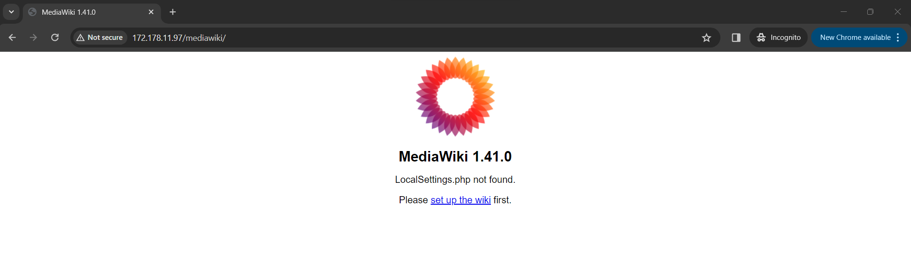

# Mediawiki on Azure Environment

This repository consists of code to deploy mediawiki application to azure environment using Terraform as the Infrastructure-as-code (IaC).

The instructions presented in this [link](https://www.mediawiki.org/wiki/Manual:Running_MediaWiki_on_Red_Hat_Linux#) are referenced to automate the process of deployment on to Red Hat Linux.

## Steps to run
1. Install Terraform
2. In your azure subscription, create an app registration and assign it 'Contributor' role at Subscription level.
3. Create a secret associated with app registration.
4. Set Environmental Variables as below (this step is to securely provide the azure, app registration details to terraform providers using Windows):

    4.1. set TF_VAR_subscription_id=<azure_subscription_id>

    4.2  set TF_VAR_client_id=<client_id>

    4.3 set TF_VAR_client_secret=<client_secret>

    4.4 set TF_VAR_tenant_id=<tenant_id> 

5. create a public key using ssh keygen.exe and keep it hand to provide the file and it's location during creation of linux VM

6. Clone this repository and open the file "deployments.tfvars". Provide public key location.

7. post clonning, run the below commands:
    
    7.1 terraform init
    
    7.2 terraform plan -var-file="deployment.tfvars" -out="outplan.out"

    7.3 terraform apply "outplan.out"

8. Post terraform scripts are completed, open browser and try access the link "http://public_ip_of_linux_vm/mediawiki/" or http://public_ip_of_linux_vm/mediawiki-1.41.0/.

    For example: if your VM's IP address is 172.178.11.97, then link is http://172.178.11.97/mediawiki/ or http://172.178.11.97/mediawiki-1.41.0/

## Sample Output:
If all the steps are completed correctly, below is the output.

## Rollback steps:
In case of deletion of resources in Azure, please use below command:

- terraform destroy -var-file="deployment.tfvars"

type "yes" when prompted to proceed with deletion of resource